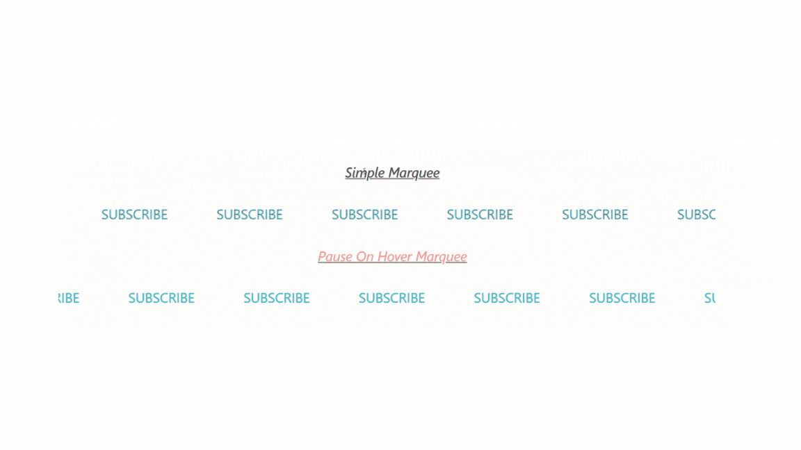

# Marquee Animation

This repository provides an example of creating smooth marquee animations using Tailwind CSS and custom CSS animations. The project includes a simple marquee and a pause-on-hover marquee.



## Features

- Smooth, continuous scrolling animation
- Reverse direction animation
- Pause on hover functionality

## Installation

1. **Clone the repository:**
    ```bash
    git clone https://github.com/chaudhary64/Marquee_Animation.git
    cd Marquee_Animation
    ```

2. **Open the project in your preferred code editor.**

## Usage

The project includes two types of marquees: a simple marquee and a pause-on-hover marquee. The animations are created using CSS keyframes and Tailwind CSS for styling.

### Customization

- **Speed**: Adjust the `animation-duration` property in the CSS for the marquee containers.
- **Direction**: Use the `animation-direction` property to control the direction of the marquee animation.
- **Pause on Hover**: The hover effect is controlled using `animation-play-state: paused;` in the CSS.

## Why justify-around for Marquee Animation ?
Using justify-around in the context of a marquee animation can provide several benefits:

- **Equal Spacing** : justify-around evenly distributes the space between and around flex items, ensuring that there is equal spacing on both sides of each item. This is beneficial for a marquee animation as it helps maintain a consistent gap between repeated content cycles.

- **Center Alignment** : Along with equal spacing, justify-around centers the flex items within the container, which can be visually appealing for a marquee effect. This centered alignment keeps the animation focused and balanced, especially when the content is scrolling continuously.

- **Responsive Design** : Tailwind CSS's utility classes like justify-around are responsive by default. This means that the spacing and alignment will adjust automatically based on the screen size or viewport, ensuring that your marquee animation looks good on various devices without manual adjustments.

By using justify-around, you ensure that your marquee animation maintains consistent spacing, centered alignment, and responsiveness across different devices, enhancing the overall visual appeal and user experience.

---

**Author**: [Chirag Chaudhary](https://github.com/chaudhary64)

**Repository**: [Marquee Animation](https://github.com/chaudhary64/Marquee_
